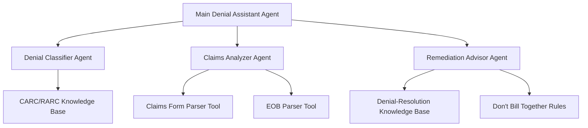

# Medical Billing Denial Agent: Project Plan

## 1. Project Overview

### 1.1 Objective
Develop a medical billing denial agent using Google's Agent Development Kit (ADK) that can process denial information, analyze causes, and provide actionable remediation steps to healthcare billing staff.

### 1.2 Success Criteria
- Agent accepts and processes claim denial context (CMS-1500 forms, EOBs, denial codes)
- Accurately identifies denial reasons based on CARC-RARC codes
- Provides clear, actionable steps for denial resolution
- Maintains conversational capabilities for follow-up questions
- Adheres to HIPAA compliance requirements
- Functions as an effective MVP for future expansion

## 2. System Architecture

### 2.1 Multi-Agent System Design



### 2.2 Core Components

**Main Denial Assistant Agent (Coordinator)**
- Primary user interface handling conversation flow
- Routes specialized tasks to sub-agents
- Maintains session context and manages conversation history

**Specialized Agents:**
- **Denial Classifier Agent**: Categorizes denial types based on codes
- **Claims Analyzer Agent**: Extracts information from claim documents
- **Remediation Advisor Agent**: Generates actionable resolution steps

**Knowledge and Memory Components:**
- Vector-based knowledge stores for medical billing reference data
- Session-based memory for conversation continuity
- Artifact storage for temporary document handling

## 3. Technical Implementation

### 3.1 ADK Features Utilization

| ADK Feature | Implementation Approach |
|-------------|-------------------------|
| Agent Types | Use `LLMAgent` with Gemini 2.0 Pro for coordinator; Workflow agents for orchestration |
| Tools | Custom function tools for document parsing and knowledge retrieval |
| Memory | `VertexAIRagMemoryService` for knowledge base integration |
| Sessions | Session management for conversation context |
| Artifacts | Temporary storage of uploaded documents |
| Callbacks | Content moderation, logging, and response formatting |

### 3.2 Tool Development

#### Document Analysis Tools
```python
@tool
def analyze_cms1500_form(form_data: bytes) -> dict:
    """
    Extracts relevant information from CMS-1500 forms.
    
    Args:
        form_data: Binary data of the CMS-1500 form
        
    Returns:
        dict: Structured data from the form including claim info
    """
    # Implementation details
```

#### Knowledge Access Tools
```python
@tool
def check_denial_codes(carc_code: str, rarc_code: str = None) -> dict:
    """
    Retrieves information about denial codes.
    
    Args:
        carc_code: The Claim Adjustment Reason Code
        rarc_code: Optional Remittance Advice Remark Code
        
    Returns:
        dict: Explanation and resolution guidance
    """
    # Implementation details
```

#### Billing Rule Verification
```python
@tool
def verify_code_compatibility(primary_code: str, secondary_code: str) -> dict:
    """
    Checks if two billing codes can be submitted together.
    
    Args:
        primary_code: The primary procedure/service code
        secondary_code: The secondary procedure/service code
        
    Returns:
        dict: Compatibility status and explanation
    """
    # Implementation details
```

### 3.3 HIPAA Compliance Measures

- Secure data handling with encryption at rest and in transit
- Authentication and authorization controls
- Comprehensive audit logging
- Data minimization practices
- Appropriate retention policies

## 4. Implementation Phases

### 4.1 Phase 1: Foundation Setup
- Project structure and environment configuration
- Base ADK agent implementation
- Knowledge base ingestion and indexing
- Initial conversation flow design

### 4.2 Phase 2: Core Functionality
- Specialized agent implementation
- Document parsing tool development
- Knowledge retrieval mechanisms
- Basic conversation handlers

### 4.3 Phase 3: Integration
- Agent orchestration
- Knowledge base connections
- Session management implementation
- Document processing pipeline

### 4.4 Phase 4: Testing & Refinement
- Testing with sample denial cases
- Model tuning for accuracy
- Conversation enhancement
- Performance optimization

### 4.5 Phase 5: Deployment
- Vertex AI deployment configuration
- Security and compliance validation
- User interface implementation
- Monitoring and logging setup

## 5. Technology Stack

### 5.1 Core Components
- **Backend**: Google ADK, Python
- **LLM**: Gemini 2.0 Pro (low temperature setting)
- **Deployment**: Vertex AI, Cloud Run
- **Knowledge Store**: Vertex AI Vector Search
- **Authentication**: Google Cloud IAM with OAuth 2.0

### 5.2 Development Environment
- Python environment with ADK dependencies
- Google Cloud project with appropriate permissions
- Test data sets of anonymized denial examples
- Development UI for agent interaction testing

## 6. Future Roadmap

### 6.1 Active Correction Capability
- Direct integration with billing systems
- Automated correction submission
- Workflow management for correction processes

### 6.2 Analytics Expansion
- Denial pattern trend analysis
- Predictive models for denial prevention
- Benchmarking and performance metrics

### 6.3 Integration Expansion
- Additional healthcare system connections
- Enhanced document processing capabilities
- Real-time notification systems

## 7. Project Risks and Mitigations

| Risk | Impact | Mitigation Strategy |
|------|--------|---------------------|
| LLM hallucinations | Incorrect guidance | Low temperature settings, strict knowledge constraints, human review |
| HIPAA compliance issues | Legal/regulatory problems | Comprehensive security review, data minimization, audit trails |
| Document parsing accuracy | Poor information extraction | Robust error handling, confidence scoring, fallback to human review |
| Knowledge base gaps | Incomplete advice | Continuous knowledge base updates, explicit uncertainty communication |
| User adoption challenges | Limited utility | Intuitive UI, clear explanations, gradual feature rollout |

## 8. Success Metrics

- **Accuracy**: % of correctly identified denial reasons
- **Resolution Rate**: % of denials successfully remediated using agent guidance
- **Conversation Quality**: Average number of follow-ups needed for resolution
- **User Satisfaction**: Feedback scores from billing staff
- **Processing Efficiency**: Time savings compared to manual processing

## 9. Technical Implementation Details

### 9.1 Agent Configuration Code Example

```python
from google.adk.agents import Agent, SequentialAgent
from google.adk.memory import VertexAIRagMemoryService

# Configure the memory service with domain knowledge
memory_service = VertexAIRagMemoryService(
    project="medical-billing-agent",
    location="us-central1",
    index_id="denial-codes-knowledge"
)

# Create specialized agents
denial_classifier = Agent(
    name="denial_classifier",
    model="gemini-2.0-pro",
    description="Classifies denial types based on CARC/RARC codes",
    instruction="""
    You are a specialized agent for classifying medical billing denials.
    Analyze CARC (Claim Adjustment Reason Codes) and RARC (Remittance Advice Remark Codes)
    to determine the exact reason for claim denial.
    Provide clear explanations that billing staff can understand.
    Always cite the specific code and its official description.
    """,
    tools=[check_denial_codes],
    memory_service=memory_service,
    temperature=0.1  # Low temperature to reduce hallucinations
)

claims_analyzer = Agent(
    name="claims_analyzer",
    model="gemini-2.0-pro-vision",  # Vision capabilities for document analysis
    description="Extracts and analyzes information from claim documents",
    instruction="""
    You are a specialized agent for analyzing medical claim documents.
    Extract relevant information from CMS-1500 forms, EOBs, and other claim documents.
    Focus on identifying key fields that may be related to the denial reason.
    Be precise and report exactly what is in the document without inference.
    """,
    tools=[analyze_cms1500_form, parse_eob],
    temperature=0.2
)

remediation_advisor = Agent(
    name="remediation_advisor",
    model="gemini-2.0-pro",
    description="Provides actionable steps to resolve claim denials",
    instruction="""
    You are a specialized agent for providing actionable steps to resolve claim denials.
    Based on the denial reason and claim details, suggest specific corrective actions.
    Your suggestions should be concrete, step-by-step, and implementable by billing staff.
    Always prioritize compliance with Medicare/Medicaid rules and regulations.
    """,
    tools=[verify_code_compatibility, check_denial_resolution],
    memory_service=memory_service,
    temperature=0.3
)

# Content moderation callback to ensure HIPAA compliance
def content_moderation_callback(callback_context, llm_response):
    """Ensure responses don't contain PHI or inappropriate content"""
    # Implementation details
    return llm_response

# Create the main coordinator agent
coordinator_agent = Agent(
    name="medical_billing_denial_assistant",
    model="gemini-2.0-pro",
    description="Assists with resolving medical billing denials",
    instruction="""
    You are a helpful medical billing denial assistant.
    Help users understand why claims were denied and how to resolve them.
    Maintain a professional, factual tone and avoid speculating.
    Remember to follow all HIPAA regulations regarding PHI.
    For specific analyses of denial codes or claim documents, delegate to specialized agents.
    Always provide clear, actionable guidance that billing staff can follow.
    """,
    sub_agents=[denial_classifier, claims_analyzer, remediation_advisor],
    enable_streaming=True,
    after_model_callback=content_moderation_callback,
    temperature=0.2
)

# Create a workflow agent to orchestrate the process
denial_management_system = SequentialAgent(
    name="denial_management_system",
    description="End-to-end system for denial management",
    agents=[coordinator_agent]
)
```

### 9.2 Deployment Configuration Example

```python
from google.adk.server import run_local_server
from google.adk.deployment import deploy_to_vertex

# For local development and testing
if __name__ == "__main__" and environment == "development":
    run_local_server(denial_management_system)

# For production deployment
if __name__ == "__main__" and environment == "production":
    deploy_to_vertex(
        agent=denial_management_system,
        project_id="medical-billing-agent",
        location="us-central1",
        machine_type="e2-standard-4",
        encryption_spec_key_name="projects/medical-billing-agent/locations/us-central1/keyRings/hipaa-keyring/cryptoKeys/data-encryption-key"
    )
```

## 10. Team Structure and Responsibilities

### 10.1 Core Development Team
- **ADK Integration Lead**: Responsible for implementing the agent architecture
- **Medical Billing SME**: Provides domain expertise and validates agent responses
- **ML Engineer**: Tunes models and implements knowledge retrieval systems
- **HIPAA Compliance Specialist**: Ensures all development meets security requirements
- **QA Specialist**: Tests agent against various denial scenarios

### 10.2 Support Roles
- **Project Manager**: Coordinates team activities and tracks progress
- **UX Designer**: Develops intuitive interface for agent interaction
- **Documentation Specialist**: Creates user guides and technical documentation

## 11. Training and Knowledge Requirements

### 11.1 Domain Knowledge Preparation
- Collection and structuring of CARC/RARC codes
- Compilation of "Don't Bill Together" rules
- Development of resolution patterns for common denials
- Documentation of Medicare/Medicaid billing requirements

### 11.2 Model Training Considerations
- Fine-tuning on medical billing terminology
- Parameter optimization for accuracy vs. creativity balance
- Prompt engineering for consistent response formats
- Regular evaluation against benchmark denial cases
