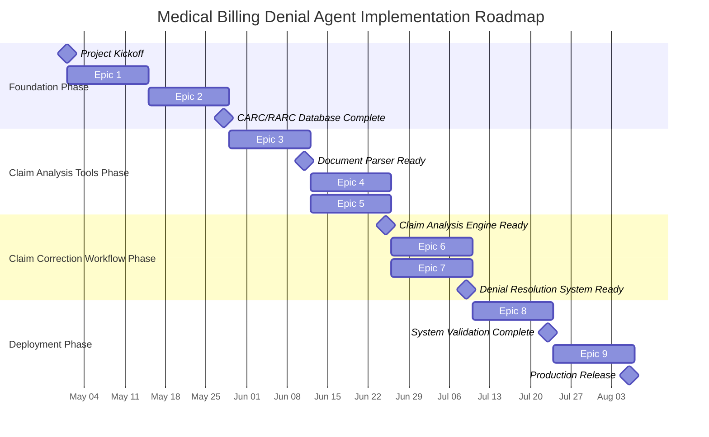

# Medical Billing Denial Agent: Implementation Roadmap

## Implementation Instructions

  
**IMPORTANT: Follow these guidelines for the implementation process:**

  
1. **Implementation Order**: Epics should be implemented in sequential order (Epic 1, Epic 2, etc.) as each builds upon the foundation of previous epics.

  
2. **User Story Completion**:
- Implement each user story within an epic along with its relevant tests
- Run and verify all tests to ensure proper functionality
- List all completed tests under the user story in a "Tests Created" section
- Mark completed stories with a checkmark emoji (✅) at the beginning of the user story title
- Completed stories will be documented with the checkmark emoji

  
3. **Epic Completion**:
- An epic is considered complete only when ALL user stories within it are completed
- Mark completed epics with a checkmark emoji (✅) at the beginning of the epic title
- Completed epics will be shown in green in the flowchart diagram

  
4. **Progress Tracking**:
- Use the checkmarks and color coding in the flowchart as visual indicators of implementation progress
- Green indicates completed epics, blue indicates active epics, and gray indicates pending epics
- Reference the tests listed under each story to verify completion
- Maintain this documentation as an up-to-date record of implementation status

## Implementation Flow

---

## ✅ Epic 1: Environment & Foundation Setup

**Description:** Establish the project structure, development environment, and core ADK configuration to enable agent development.

### User Stories

#### ✅ US 1.1: Project Repository Setup
**As a** developer,  
**I want** a properly structured project repository,  
**So that** I can organize code and assets efficiently.

**Acceptance Criteria:**
- Project repository created with appropriate directory structure
- README file documented with project overview and setup instructions
- .gitignore configured for Python development
- Required dependencies listed in requirements.txt
- Environment variables template created
- ADK integration configured properly

**Tests Created:**
- test_repository_structure - Tests proper structure and organization of the project repository
- test_core_directories_exist - Ensures all required directories are present
- test_core_files_exist - Verifies essential files exist
- test_package_init_files_exist - Confirms Python package structure is correct
- test_environment_file_format - Validates .env.example format and content
- test_readme_content - Checks that README contains required sections

#### ✅ US 1.2: Development Environment Configuration
**As a** developer,  
**I want** a complete development environment set up,  
**So that** I can develop, test, and debug the agent effectively.

**Acceptance Criteria:**
- Python environment with ADK dependencies installed
- Google Cloud project properly configured
- Local development server functional
- Access to required API keys and services configured
- Test datasets (sample denials) available in the environment
- Linting and testing tools configured

**Tests Created:**
- setup.py - Enables development mode installation of the package
- config/environment.py - Environment configuration and validation
- load_environment - Loads environment variables from .env file
- validate_environment - Validates required environment variables
- check_google_cloud_setup - Verifies Google Cloud configuration
- CLI interface in run.py - Provides local development testing environment

#### ✅ US 1.3: Base Agent Framework Implementation
**As a** developer,  
**I want** the base ADK agent infrastructure implemented,  
**So that** I can build specific agent functionality on top of it.

**Acceptance Criteria:**
- Basic agent configuration using ADK established
- Configuration for Gemini 2.0 Pro integration completed
- Session management framework implemented
- Basic conversation handler configured
- Logging infrastructure established
- Empty placeholder structure for sub-agents created

**Tests Created:**
- test_session_manager.py - Comprehensive tests for session management
- test_coordinator_agent.py - Tests for the main agent functionality
- test_agent_system.py - Integration tests for the agent system
- test_session_creation - Verifies session creation and ID generation
- test_session_update - Tests session context updates
- test_add_conversation_turn - Verifies conversation history recording
- test_process_query_new_session - Tests processing queries with new sessions
- test_process_query_existing_session - Tests with existing session context

---

## ✅ Epic 2: Knowledge Base Integration

**Description:** Develop and integrate the specialized knowledge bases required for denial management, including CARC/RARC codes and resolution strategies.

### User Stories

#### ✅ US 2.1: CARC/RARC Knowledge Base Development
**As a** developer,  
**I want** a comprehensive knowledge base of CARC/RARC codes,  
**So that** the agent can accurately identify denial reasons.

**Acceptance Criteria:**
- Complete dataset of CARC (Claim Adjustment Reason Codes) compiled
- Complete dataset of RARC (Remittance Advice Remark Codes) compiled
- Code descriptions and explanations included
- Knowledge structured for efficient retrieval
- Vector embedding process established
- Knowledge base indexed and searchable

**Tests Created:**
- test_carc_rarc_knowledge_base - Validates the structure and content of the CARC/RARC knowledge base
- Knowledge base completeness test - Verifies all essential CARC/RARC codes are present
- Code description validation test - Ensures all codes have proper descriptions
- Denial type categorization test - Checks that codes are properly categorized by denial type
- Resolution steps verification test - Confirms resolution steps are included for each code

#### ✅ US 2.2: Resolution Knowledge Base Development
**As a** developer,  
**I want** a knowledge base of denial resolution strategies,  
**So that** the agent can provide actionable remediation steps.

**Acceptance Criteria:**
- Resolution strategies for common denial scenarios documented
- Step-by-step remediation instructions included
- Billing rule explanations and references included
- Knowledge structured for retrieval by denial type
- Vector embedding process established
- Knowledge base indexed and searchable

**Tests Created:**
- test_resolution_knowledge_base - Validates the structure and content of resolution strategies
- Strategy completeness test - Verifies strategies for all essential denial types
- Strategy structure test - Ensures each strategy has required components (name, description, steps, etc.)
- Billing rule references test - Checks that documentation requirements and references are included
- Strategy content test - Validates that steps are actionable and comprehensive

#### ✅ US 2.3: Memory Service Integration
**As a** developer,  
**I want** to integrate VertexAIRagMemoryService with the agent system,  
**So that** knowledge can be efficiently accessed during conversations.

**Acceptance Criteria:**
- VertexAIRagMemoryService properly configured
- Knowledge bases connected to the memory service
- Query mechanisms optimized for relevant retrieval
- Memory service integrated with agent framework
- Session-based memory implementation for conversation context
- Performance metrics established for retrieval

**Tests Created:**
- test_memory_service_integration - Validates the Memory Service functionality
- Service initialization test - Verifies proper configuration and startup
- Knowledge base connection test - Ensures all knowledge bases are accessible
- Session management test - Checks creation, retrieval, and deletion of sessions
- Context storage test - Validates session context storage and retrieval
- Conversation history test - Confirms conversation turns are properly recorded
- Query performance test - Measures retrieval speed and accuracy

#### ✅ US 2.4: "Don't Bill Together" Rules Integration
**As a** developer,  
**I want** to integrate billing compatibility rules,  
**So that** the agent can identify code conflicts in claims.

**Acceptance Criteria:**
- Comprehensive set of "Don't Bill Together" rules compiled
- Rules structured for efficient retrieval
- Code compatibility checking tool implemented
- Integration with the resolution knowledge base
- Documentation of rule sources and references

**Tests Created:**
- test_dont_bill_together_integration - Validates the Don't Bill Together knowledge base
- Structure validation test - Checks the format of the code pairs data
- Modifier indicator test - Verifies correct modifier indicators for each rule type
- Compatibility checking test - Ensures code compatibility queries return correct results
- Resolution guidance test - Validates resolution guidance for code conflicts
- Documentation requirements test - Checks that documentation requirements are present

#### End-to-End Testing
**Tests Created:**
- test_end_to_end_resolution_flow - Validates the complete workflow from claim intake to resolution
- test_knowledge_files_created - Ensures all knowledge base files are properly generated
- Integration test - Verifies all components work together seamlessly

---

## ✅ Epic 3: Document Processing Tools

**Description:** Develop the tools needed to extract and analyze information from medical billing documents such as CMS-1500 forms and EOBs.

### User Stories

#### ✅ US 3.1: CMS-1500 Form Parser Tool
**As a** developer,  
**I want** a tool that can extract information from CMS-1500 forms,  
**So that** the agent can analyze claim details.

**Acceptance Criteria:**
- Tool accepts CMS-1500 form images/PDFs
- Accurately extracts key fields including patient information, provider information, diagnosis codes, procedure codes, and billing amounts
- Structures extracted data in a format suitable for agent processing
- Handles various form formats and qualities
- Implements error handling for incomplete or unclear forms
- Returns confidence scores for extracted information

**Tests Created:**
- test_cms1500_parser - Tests basic functionality of the parser
- form_extraction_test - Tests extraction from sample CMS-1500 forms
- field_extraction_test - Tests extraction of key fields
- error_handling_test - Tests handling of incomplete or unclear forms 
- confidence_scoring_test - Tests confidence score calculations

#### ✅ US 3.2: EOB Parser Tool
**As a** developer,  
**I want** a tool that can extract information from Explanation of Benefits documents,  
**So that** the agent can analyze denial details.

**Acceptance Criteria:**
- Tool accepts EOB documents in various formats
- Accurately extracts key fields including denial codes, claim identifiers, adjustment amounts, and payer information
- Identifies CARC and RARC codes in the document
- Structures extracted data for agent processing
- Implements error handling for incomplete or unclear documents
- Returns confidence scores for extracted information

**Tests Created:**
- test_eob_parser - Tests basic functionality of the parser
- eob_extraction_test - Tests extraction from sample EOB documents
- carc_rarc_detection_test - Tests identification of denial codes
- eob_error_handling_test - Tests handling of incomplete documents
- eob_confidence_scoring_test - Tests confidence score calculations

#### ✅ US 3.3: Document Artifact Management
**As a** developer,  
**I want** a system to manage document artifacts during processing,  
**So that** document data can be securely handled throughout the conversation flow.

**Acceptance Criteria:**
- Secure temporary storage for uploaded documents
- Document data encryption at rest
- Proper document cleanup after processing
- Artifact linking to conversation sessions
- Document access controls implemented
- HIPAA-compliant handling of all document data

**Tests Created:**
- test_artifact_manager - Comprehensive test suite for the ArtifactManager class
- test_store_document_tool - Tests document storage functionality
- test_retrieve_document_tool - Tests document retrieval functionality
- test_delete_document_tool - Tests document deletion functionality
- test_list_session_documents_tool - Tests session document listing
- test_cleanup_expired_artifacts - Tests automatic cleanup of expired documents
- test_session_linking - Tests linking artifacts to conversation sessions
- test_get_artifacts_by_session - Tests retrieving artifacts by session ID

---

## ✅ Epic 4: Main Denial Assistant Agent

**Description:** Develop the primary user interface agent that coordinates the conversation flow and delegates to specialized agents.

### User Stories

#### ✅ US 4.1: Conversation Flow Design
**As a** developer,  
**I want** to implement a structured conversation flow for the main agent,  
**So that** users can interact with the system naturally.

**Acceptance Criteria:**
- Initial greeting and purpose explanation
- User input collection for denial information
- Document upload/processing flow
- Question handling and response generation
- Session context maintenance
- Clear, professional communication style
- Appropriate handling of user confusion or off-topic queries

**Tests Created:**
- test_determine_conversation_state - Tests that state is correctly determined from context
- test_format_response - Tests that responses are properly formatted by type
- test_generate_text - Tests context-aware response generation
- test_process_query_state_transition - Tests conversation state transitions
- test_content_moderation_callback - Tests response formatting and standardization

#### ✅ US 4.2: Task Routing System
**As a** developer,  
**I want** to implement a task routing mechanism in the main agent,  
**So that** specialized tasks are delegated to appropriate sub-agents.

**Acceptance Criteria:**
- Task classification logic implemented
- Routing rules for all specialized agents defined
- Context passing between agents implemented
- Response integration from multiple agents
- Error handling for routing failures
- Performance monitoring for routing decisions

**Tests Created:**
- test_detect_intent - Tests accurate detection of user intent from queries
- test_route_to_specialized_agent - Tests routing to appropriate specialized agents
- test_coordinator_agent_initialization - Tests proper initialization of routing structure
- test_process_query_new_session - Tests routing in new sessions
- test_process_query_existing_session - Tests routing with existing context

#### ✅ US 4.3: Session Management
**As a** developer,  
**I want** comprehensive session management in the main agent,  
**So that** conversation context is maintained throughout interactions.

**Acceptance Criteria:**
- Session creation and identification
- Context storage and retrieval
- Document reference persistence
- Conversation history maintenance
- Session timeout and management
- Session data security controls

**Tests Created:**
- test_session_creation - Tests session creation with initial context
- test_get_document_references - Tests document reference retrieval
- test_add_document_reference - Tests adding document references to sessions
- test_remove_document_reference - Tests document reference removal
- test_get_conversation_history - Tests conversation history retrieval
- test_add_conversation_turn_with_metadata - Tests adding turns with metadata
- test_history_truncation - Tests automatic history management
- test_export_import_session - Tests session persistence functionality
- test_cleanup_expired_sessions - Tests session timeout handling

#### ✅ US 4.4: Response Generation & Formatting
**As a** developer,  
**I want** high-quality response generation and formatting,  
**So that** users receive clear, actionable information.

**Acceptance Criteria:**
- Consistent response structure
- Clear formatting for step-by-step instructions
- Appropriate citation of sources and codes
- Handling of uncertainty with appropriate disclaimers
- Professional tone and language
- Compliance with medical billing terminology standards

**Tests Created:**
- test_format_response - Tests consistent formatting of different response types
- test_content_moderation_callback - Tests addition of headers and disclaimers
- test_generate_text - Tests context-aware response generation
- test_process_query_new_session - Tests response structure consistency
- test_route_to_specialized_agent - Tests proper response formatting from specialized agents

---

## Epic 5: Specialized Agents Development

**Description:** Develop the three specialized agents that handle specific aspects of denial management.

### User Stories

#### US 5.1: Denial Classifier Agent
**As a** developer,  
**I want** to implement the Denial Classifier Agent,  
**So that** denial codes can be accurately interpreted and categorized.

**Acceptance Criteria:**
- Agent configured with Gemini 2.0 Pro
- Integration with CARC/RARC knowledge base
- Accurate classification of denial types based on codes
- Clear explanation of code meanings and implications
- Low temperature setting to reduce hallucinations
- Appropriate handling of unknown or ambiguous codes

**Tests:**
- Code interpretation accuracy test
- Classification accuracy test for various denial types
- Knowledge base integration test
- Explanation clarity evaluation
- Ambiguous code handling test

#### US 5.2: Claims Analyzer Agent
**As a** developer,  
**I want** to implement the Claims Analyzer Agent,  
**So that** claim documents can be thoroughly analyzed for relevant information.

**Acceptance Criteria:**
- Agent configured with Gemini 2.0 Pro Vision for document analysis
- Integration with document parsing tools
- Extraction of relevant claim details from documents
- Identification of potential issues in claim submissions
- Connection to relevant billing rules and requirements
- Error handling for document quality issues

**Tests:**
- Document analysis accuracy test
- Integration test with document parsing tools
- Key field extraction test
- Issue identification accuracy test
- Error handling test with low-quality documents

#### US 5.3: Remediation Advisor Agent
**As a** developer,  
**I want** to implement the Remediation Advisor Agent,  
**So that** actionable steps for denial resolution can be provided.

**Acceptance Criteria:**
- Agent configured with Gemini 2.0 Pro
- Integration with resolution knowledge base
- Generation of step-by-step remediation instructions
- Code compatibility verification functionality
- Prioritization of actions based on denial type
- Inclusion of relevant regulatory references

**Tests:**
- Resolution advice accuracy test for various denial types
- Step-by-step instruction quality test
- Knowledge base integration test
- Code compatibility verification test
- Regulatory compliance verification test

---

## Epic 6: Agent Orchestration System

**Description:** Implement the system to coordinate the multiple agents and enable smooth information flow between components.

### User Stories

#### US 6.1: Agent Communication Protocol
**As a** developer,  
**I want** a standardized communication protocol between agents,  
**So that** information can flow efficiently through the system.

**Acceptance Criteria:**
- Structured message format for inter-agent communication
- Context passing mechanisms implemented
- Error handling for communication failures
- Tracing and logging of inter-agent messages
- Performance optimization for message passing
- Standardized response formats from each agent

**Tests:**
- Message format validation test
- Context passing accuracy test
- Error handling test with simulated failures
- Trace logging verification test
- Performance benchmark test

#### US 6.2: Sequential Workflow Implementation
**As a** developer,  
**I want** to implement the SequentialAgent workflow,  
**So that** the denial management process follows a logical flow.

**Acceptance Criteria:**
- SequentialAgent configuration with all component agents
- Workflow definition for denial processing
- Conditional logic for various denial scenarios
- Error handling and recovery procedures
- Performance monitoring for workflow execution
- Workflow visualization capabilities

**Tests:**
- Workflow initialization test
- Complete process flow test with sample cases
- Conditional logic verification test
- Error recovery test
- Performance benchmark test

#### US 6.3: Result Integration System
**As a** developer,  
**I want** a system to integrate results from multiple agents,  
**So that** cohesive, comprehensive responses are presented to users.

**Acceptance Criteria:**
- Result collection from all relevant agents
- Conflict resolution for contradictory information
- Comprehensive response formation
- Appropriate attribution of information sources
- Formatting for readability and action
- Performance optimization for response generation

**Tests:**
- Result collection accuracy test
- Conflict resolution test with contradictory inputs
- Response cohesiveness evaluation
- Attribution accuracy test
- Format consistency test

---

## Epic 7: Compliance & Security

**Description:** Implement security measures and compliance controls to ensure HIPAA requirements are met throughout the system.

### User Stories

#### US 7.1: HIPAA Compliance Framework
**As a** developer,  
**I want** to implement a comprehensive HIPAA compliance framework,  
**So that** all PHI is handled according to regulations.

**Acceptance Criteria:**
- Data encryption at rest and in transit
- Access controls for all sensitive information
- Audit logging of all system activities
- Data minimization practices implemented
- Retention policy enforcement
- Technical controls documentation

**Tests:**
- Encryption implementation test
- Access control verification test
- Audit log completeness test
- Data minimization verification test
- Retention policy enforcement test

#### US 7.2: Content Moderation System
**As a** developer,  
**I want** to implement content moderation for agent responses,  
**So that** inappropriate or non-compliant content is filtered.

**Acceptance Criteria:**
- After-model callback for content moderation
- PHI detection and handling mechanisms
- Inappropriate content detection
- Response filtering based on compliance rules
- Logging of moderation decisions
- Alternative response generation for filtered content

**Tests:**
- PHI detection accuracy test
- Content moderation accuracy test
- Filter action verification test
- Moderation logging verification test
- Alternative response quality test

#### US 7.3: Error Handling & Fallback System
**As a** developer,  
**I want** a comprehensive error handling and fallback system,  
**So that** the system remains reliable even in exceptional conditions.

**Acceptance Criteria:**
- Graceful error handling for all components
- Appropriate error messages for different scenarios
- Fallback mechanisms for component failures
- Recovery procedures for interrupted sessions
- Comprehensive error logging
- User guidance during system failures

**Tests:**
- Error handling verification for each component
- Error message appropriateness test
- Fallback mechanism effectiveness test
- Recovery procedure verification test
- Error logging completeness test

---

## Epic 8: Testing & Quality Assurance

**Description:** Implement comprehensive testing and quality assurance measures to ensure system reliability and accuracy.

### User Stories

#### US 8.1: Test Suite Development
**As a** developer,  
**I want** a comprehensive test suite for all system components,  
**So that** reliability and correctness can be verified.

**Acceptance Criteria:**
- Unit tests for all components and tools
- Integration tests for agent interactions
- End-to-end tests for complete workflows
- Performance tests for response time and throughput
- Security tests for compliance controls
- Test automation infrastructure

**Tests:**
- Test coverage measurement
- Test automation execution
- Test reliability verification
- Edge case handling verification
- Test documentation completeness

#### US 8.2: Evaluation Framework
**As a** developer,  
**I want** an evaluation framework for agent responses,  
**So that** accuracy and effectiveness can be measured.

**Acceptance Criteria:**
- Evaluation metrics defined for different aspects (accuracy, helpfulness, etc.)
- Benchmark dataset of denial scenarios
- Automated evaluation pipeline
- Comparison metrics against baseline approaches
- Regular evaluation reporting
- Feedback collection mechanisms

**Tests:**
- Evaluation pipeline execution test
- Metric calculation accuracy test
- Benchmark relevance verification
- Reporting completeness test
- Feedback collection verification test

#### US 8.3: Model Tuning & Optimization
**As a** developer,  
**I want** to optimize the LLM parameters and prompts,  
**So that** agent performance is maximized.

**Acceptance Criteria:**
- Systematic parameter tuning methodology
- Prompt engineering for each agent role
- Performance benchmarking for different configurations
- Documentation of optimal settings
- Versioning of model configurations
- A/B testing framework for configuration comparison

**Tests:**
- Parameter impact measurement
- Prompt effectiveness evaluation
- Benchmark performance comparison
- Configuration versioning verification
- A/B testing execution verification

---

## Epic 9: Deployment & Operations

**Description:** Configure and implement the deployment and operational infrastructure for the production system.

### User Stories

#### US 9.1: Vertex AI Deployment
**As a** developer,  
**I want** to deploy the agent system to Vertex AI,  
**So that** it can be accessed in a production environment.

**Acceptance Criteria:**
- Deployment configuration for Vertex AI
- Resource allocation optimization
- Security controls in the deployed environment
- Monitoring and alerting setup
- Documentation of deployment process
- Rollback procedures defined

**Tests:**
- Deployment verification test
- Resource allocation verification
- Security control validation in deployed environment
- Monitoring functionality test
- Rollback procedure verification

#### US 9.2: User Interface Implementation
**As a** developer,  
**I want** to implement an intuitive user interface,  
**So that** billing staff can easily interact with the agent.

**Acceptance Criteria:**
- Conversational interface implementation
- Document upload capabilities
- Clear display of agent responses
- Mobile and desktop compatibility
- Accessibility compliance
- UI/UX design documentation

**Tests:**
- Interface functionality test
- Document upload verification
- Response display clarity test
- Responsive design verification
- Accessibility compliance test

#### US 9.3: Monitoring & Logging System
**As a** developer,  
**I want** a comprehensive monitoring and logging system,  
**So that** system health and performance can be tracked.

**Acceptance Criteria:**
- Health monitoring for all components
- Performance metrics collection
- Error and exception logging
- Usage statistics tracking
- Alerting for critical issues
- Dashboard for system overview

**Tests:**
- Health monitoring functionality test
- Metric collection verification
- Logging completeness test
- Alert triggering verification
- Dashboard functionality test

#### US 9.4: Documentation & Training Materials
**As a** developer,  
**I want** comprehensive documentation and training materials,  
**So that** users and administrators can effectively utilize the system.

**Acceptance Criteria:**
- User guide with usage instructions
- Administrator documentation
- API documentation if applicable
- Training materials for billing staff
- Troubleshooting guide
- FAQs and common use cases

**Tests:**
- Documentation completeness verification
- Training material effectiveness evaluation
- Troubleshooting guide accuracy test
- FAQ relevance verification
- User feedback collection on documentation
