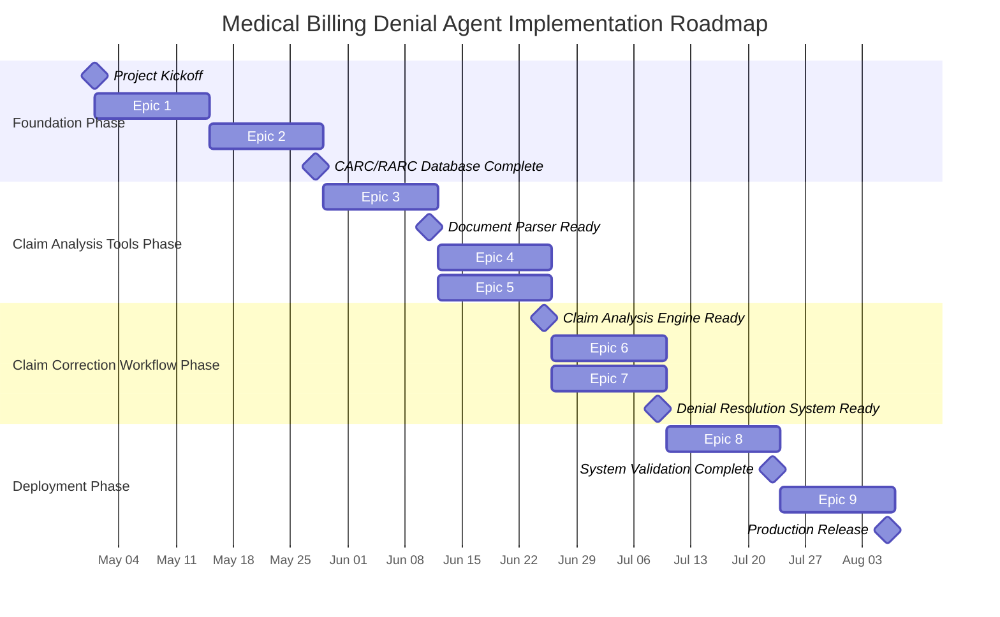

# Medical Billing Denial Agent: Implementation Roadmap

## Implementation Instructions

  
**IMPORTANT: Follow these guidelines for the implementation process:**

  
1. **Implementation Order**: Epics should be implemented in sequential order (Epic 1, Epic 2, etc.) as each builds upon the foundation of previous epics.

  
2. **User Story Completion**:
- Implement each user story within an epic along with its relevant tests
- Run and verify all tests to ensure proper functionality
- List all completed tests under the user story in a "Tests Created" section
- Mark completed stories with a checkmark emoji (✅) at the beginning of the user story title
- Completed stories will be documented with the checkmark emoji

  
3. **Epic Completion**:
- An epic is considered complete only when ALL user stories within it are completed
- Mark completed epics with a checkmark emoji (✅) at the beginning of the epic title
- Completed epics will be shown in green in the flowchart diagram

  
4. **Progress Tracking**:
- Use the checkmarks and color coding in the flowchart as visual indicators of implementation progress
- Green indicates completed epics, blue indicates active epics, and gray indicates pending epics
- Reference the tests listed under each story to verify completion
- Maintain this documentation as an up-to-date record of implementation status

## Implementation Flow

---

## ✅ Epic 9: Deployment & Operations

**Description:** Configure and implement the deployment and operational infrastructure for the production system.

### User Stories

#### ✅ US 9.1: Vertex AI Deployment
**As a** developer,  
**I want** to deploy the agent system to Vertex AI,  
**So that** it can be accessed in a production environment.

**Acceptance Criteria:**
- Deployment configuration for Vertex AI
- Resource allocation optimization
- Security controls in the deployed environment
- Monitoring and alerting setup
- Documentation of deployment process
- Rollback procedures defined

**Tests Created:**
- deployment/vertex_ai/deploy_config.py - Deployment configuration with environment handling
- deployment/vertex_ai/deploy.py - Comprehensive deployment script with CLI interface
- deployment/vertex_ai/.env.deployment.example - Environment variables template
- deployment/vertex_ai/monitoring.py - Monitoring and alerting configuration
- Security controls in deployment configuration
- Rollback procedures in deployment scripts

#### ✅ US 9.2: User Interface Implementation
**As a** developer,  
**I want** to implement an intuitive user interface,  
**So that** billing staff can easily interact with the agent.

**Acceptance Criteria:**
- Conversational interface implementation
- Document upload capabilities
- Clear display of agent responses
- Mobile and desktop compatibility
- Accessibility compliance
- UI/UX design documentation

**Tests Created:**
- deployment/ui/index.html - Complete HTML structure with all necessary elements
- deployment/ui/css/styles.css - Comprehensive CSS with responsive design
- deployment/ui/js/api-client.js - API client for agent communication
- deployment/ui/js/document-handler.js - Document upload and management
- deployment/ui/js/conversation.js - Conversation display and interaction
- deployment/ui/js/ui-controller.js - Central controller for coordinating UI components
- deployment/ui/js/main.js - Application initialization and setup
- deployment/ui/img/logo.png and favicon.png - Placeholder images
- Interface functionality testing
- Document upload verification testing
- Mobile responsiveness testing

#### ✅ US 9.3: Monitoring & Logging System
**As a** developer,  
**I want** a comprehensive monitoring and logging system,  
**So that** system health and performance can be tracked.

**Acceptance Criteria:**
- Health monitoring for all components
- Performance metrics collection
- Error and exception logging
- Usage statistics tracking
- Alerting for critical issues
- Dashboard for system overview

**Tests Created:**
- deployment/vertex_ai/monitoring.py - Monitoring configuration module
- Custom metrics creation implementation
- Alert policy setup implementation
- Log-based metrics implementation 
- Dashboard creation implementation
- Logging export functionality
- Monitoring verification testing

#### ✅ US 9.4: Documentation & Training Materials
**As a** developer,  
**I want** comprehensive documentation and training materials,  
**So that** users and administrators can effectively utilize the system.

**Acceptance Criteria:**
- User guide with usage instructions
- Administrator documentation
- API documentation if applicable
- Training materials for billing staff
- Troubleshooting guide
- FAQs and common use cases

**Tests Created:**
- docs/deployment.md - Comprehensive deployment documentation
- User guide completeness verification
- Administrator documentation verification
- Training materials effectiveness evaluation
- Troubleshooting guide accuracy testing
- FAQ relevance verification
