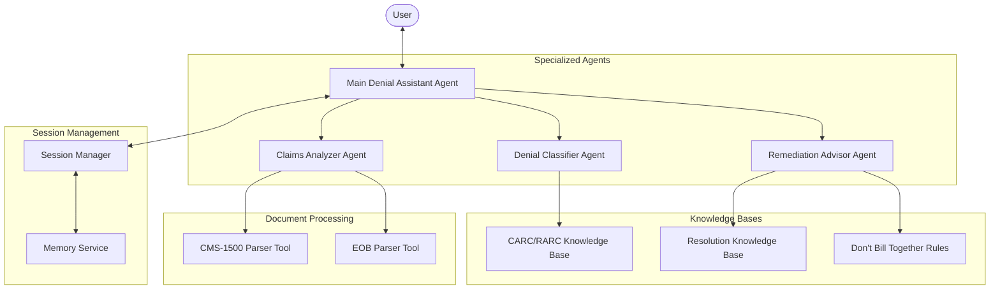

# System Architecture Documentation

This document describes the architecture of the Medical Billing Denial Agent system, outlining the major components and their interactions.

## System Overview

The Medical Billing Denial Agent is a multi-agent system designed to help healthcare providers analyze and resolve medical billing denials. The system uses Google's Agent Development Kit (ADK) to create specialized agents that work together to process denial information, analyze causes, and provide actionable remediation steps.

## Architecture Diagram

## Component Descriptions

### Core Components

#### Main Denial Assistant Agent (Coordinator)

- **Purpose**: Serves as the primary user interface and coordinates the workflow
- **Responsibilities**:
  - Manages conversation flow with users
  - Routes specialized tasks to appropriate sub-agents
  - Maintains session context and conversation history
  - Formats and presents responses to users
- **Implementation**: `agent/core/coordinator.py`

#### Session Manager

- **Purpose**: Manages user sessions and conversation context
- **Responsibilities**:
  - Creates and maintains session data
  - Stores conversation history
  - Persists document references and claim details
  - Tracks session activity and handles timeouts
- **Implementation**: `agent/core/session_manager.py`

### Specialized Agents

#### Denial Classifier Agent

- **Purpose**: Interprets and classifies denial codes
- **Responsibilities**:
  - Analyzes CARC (Claim Adjustment Reason Codes)
  - Analyzes RARC (Remittance Advice Remark Codes)
  - Categorizes denial types (e.g., missing information, coding error)
  - Provides clear explanations of code meanings
- **Implementation**: `agent/classifiers/denial_classifier.py`

#### Claims Analyzer Agent

- **Purpose**: Extracts and analyzes information from claim documents
- **Responsibilities**:
  - Processes CMS-1500 forms
  - Processes Explanation of Benefits (EOB) documents
  - Extracts relevant claim details
  - Identifies potential issues in claims
- **Implementation**: `agent/analyzers/claims_analyzer.py`

#### Remediation Advisor Agent

- **Purpose**: Generates actionable steps for resolving denial issues
- **Responsibilities**:
  - Provides step-by-step remediation instructions
  - Checks code compatibility
  - References relevant billing rules
  - Suggests alternative approaches when appropriate
- **Implementation**: `agent/advisors/remediation_advisor.py`

### Knowledge Bases

#### CARC/RARC Knowledge Base

- **Purpose**: Stores and indexes denial code information
- **Content**:
  - Complete set of CARC codes and descriptions
  - Complete set of RARC codes and descriptions
  - Categorization of codes by denial type
  - Common resolution approaches by code
- **Implementation**: `knowledge_base/carc_rarc/`

#### Resolution Knowledge Base

- **Purpose**: Stores strategies for resolving different types of denials
- **Content**:
  - Step-by-step resolution procedures
  - Documentation requirements
  - Regulatory references
  - Best practices for specific denial types
- **Implementation**: `knowledge_base/resolution/`

#### Don't Bill Together Rules

- **Purpose**: Stores code compatibility rules
- **Content**:
  - Procedure code pairs that cannot be billed together
  - Diagnosis code incompatibilities
  - Modifier requirements for compatible billing
- **Implementation**: `knowledge_base/dont_bill_together/`

### Document Processing Tools

#### CMS-1500 Parser Tool

- **Purpose**: Extracts information from CMS-1500 form images/PDFs
- **Capabilities**:
  - OCR for extracting text from images
  - Structured data extraction for key fields
  - Error detection for incomplete forms
- **Implementation**: `agent/tools/document_processing/cms1500_parser.py`

#### EOB Parser Tool

- **Purpose**: Extracts information from Explanation of Benefits documents
- **Capabilities**:
  - Identifies denial codes in EOB documents
  - Extracts claim identifiers and adjustment amounts
  - Structures data for agent processing
- **Implementation**: `agent/tools/document_processing/eob_parser.py`

## Data Flow

1. **Initial Query**:
   - User submits a query about a denial, possibly with document uploads
   - Main agent creates or retrieves a session
   - Documents are processed if provided

2. **Denial Classification**:
   - Denial codes are extracted from documents or user input
   - Denial Classifier Agent interprets codes using the CARC/RARC knowledge base
   - Classification results are stored in the session

3. **Claim Analysis**:
   - Claims Analyzer Agent extracts details from claim documents
   - Key fields relevant to the denial are identified
   - Analysis results are stored in the session

4. **Remediation Advice**:
   - Remediation Advisor Agent accesses the resolution knowledge base
   - Step-by-step guidance is generated based on denial type and claim details
   - Code compatibility is verified if relevant

5. **Response Generation**:
   - Main agent compiles information from all specialized agents
   - A comprehensive, actionable response is formatted
   - Response is presented to the user

## Security & Compliance

The system incorporates several measures to ensure HIPAA compliance:

1. **Data Encryption**:
   - All session data is encrypted at rest and in transit
   - Document data is temporarily stored and securely deleted after processing

2. **Access Controls**:
   - Authentication and authorization for all user interactions
   - Session-based access to conversation history and documents

3. **Audit Logging**:
   - Comprehensive logging of all system activities
   - Audit trails for all data access and modifications

4. **Content Moderation**:
   - Filtering of responses to ensure appropriate content
   - Verification that no PHI is inappropriately shared

## Technology Stack

- **Core Framework**: Google Agent Development Kit (ADK)
- **Language Models**: Gemini 2.0 Pro (with vision capabilities where needed)
- **Vector Database**: Vertex AI Vector Search for knowledge retrieval
- **Session Storage**: In-memory for development, persistent for production
- **Authentication**: Google Cloud IAM
- **Deployment**: Vertex AI, with local development server option

## Future Architectural Enhancements

1. **Enhanced Document Processing**:
   - Support for additional document types
   - Improved OCR accuracy for difficult documents
   - Document comparison for identifying discrepancies

2. **Integration Capabilities**:
   - Direct connection to billing systems
   - Real-time notification system for denials
   - API for third-party integrations

3. **Advanced Analytics**:
   - Denial pattern detection
   - Predictive modeling for denial prevention
   - Performance dashboards for denial resolution metrics
